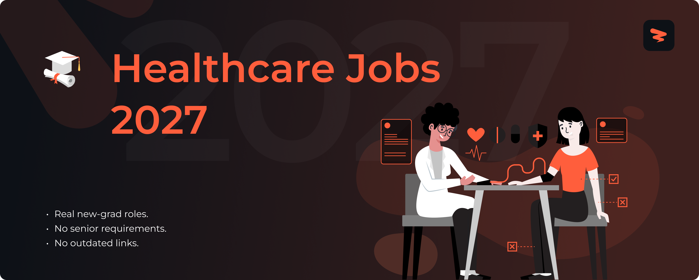

<!-- Cover -->

# Healthcare Jobs 2027

🚀 Healthcare and nursing jobs for new graduates, updated in real time.

> [!TIP]
> 🛠 Help us grow! Add new jobs by submitting an issue! View contributing steps [here](CONTRIBUTING-GUIDE.md).
---

## **Website & Autofill Extension**

Explore Zapply's website and check out:

- Our chrome extension that autofills your job applications in seconds.
- A dedicated job board with the latest jobs for various types of roles.
- User account providing multiple profiles for different resume roles.
- Job application tracking with streaks to unlock commitment awards.

Experience an advanced career journey with us! 🚀

  

## Explore Around

Connect and seek advice from a growing network of fellow students and new grads.

  
  &nbsp;&nbsp;
  
  &nbsp;&nbsp;
  

---

<h3>🏥 <strong>Nursing</strong></h3>

| Company | Role | Location | Posted | **Apply** |
|---------|------|----------|--------|----------|
| **Pfizer** | Cardiovascular Specialist, Health and... | California | 10m |  |
| **Wolters Kluwer** | Clinical Content Specialist - Nursing... | 12 Locations | 11m |  |
| **Highmark Health** | Patient Care Technician I - E9 - Surg... | Pittsburgh PA, 15... | 12m |  |
| **Highmark Health** | Nocturnist - Pittsburgh, Pennsylvania | Pittsburgh PA, 15212 | 12m |  |
| **Guidehouse** | Clinical Denials and Appeals RN | Remote | 12m |  |
| **CVS Health** | Licensed Practical Nurse - LPN | Fort Mill, SC | 12m |  |
| **CVS Health** | Licensed Practical Nurse - LPN | Simpsonville, SC | 12m |  |
| **CVS Health** | Advance Practice Provider NP/PA | Houston, TX | 12m |  |
| **Cigna** | Pharmacy Implementation Manager (Clie... | United States Wor... | 12m |  |
| **Elevance Health** | Registered Nurse (PRN) – Paragon Infu... | Nashville, TN | 13m |  |
| **Elevance Health** | Regional Account Liaison - BioPlus Sp... | Walnut Creek, CA | 13m |  |
| **Elevance Health** | Family Nurse Practitioner | 3 Locations | 13m |  |
| **Biogen** | (Sr) Medical Science Liaison, Multipl... | Columbus, OH + 1 ... | 13m |  |
| **Nokia** | IP R&D Lab Technologist Co-op/Intern | United States | 14m |  |
| **IDEXX** | Medical Laboratory Technician - PRN -... | Louisville, KY | 25m |  |
| **Wash U** | Nurse Practitioner - WUCA Nash Pediat... | St. Louis, MO | 25m |  |
| **Wash U** | Phlebotomist II (PRN) - Obstetrics an... | Washington Univer... | 25m |  |
| **Wash U** | RN Clinical Nurse Coordinator - (Outp... | Chesterfield, MO ... | 25m |  |
| **Fresenius Medical Care** | Patient Care Technician - PCT | CA016 Thousand Oa... | 25m |  |
| **Fresenius Medical Care** | Licensed Practical Nurse - LPN LVN | Meridianville, AL | 25m |  |
| **Fresenius Medical Care** | Patient Care Technician - PCT | Homestead, FL | 25m |  |
| **Vertex Pharmaceuticals** | Field Reimbursement Manager - Kidney ... | United States Fie... | 26m |  |
| **Vertex Pharmaceuticals** | Field Reimbursement Manager - Kidney ... | United States Fie... | 26m |  |
| **Vertex Pharmaceuticals** | Field Reimbursement Manager - Kidney ... | United States Fie... | 26m |  |
| **Cardinal Health** | PRN Retail Pharmacy Technician (Sonom... | Sonoma Pharmacy, CA | 27m |  |
| **Cardinal Health** | PRN Hospital Pharmacist | Harrisonville, MO | 27m |  |
| **Cardinal Health** | Licensed Vocational Nurse | cCARE Clinic, CA | 27m |  |
| **Takeda** | Plasma Center Nurse- RN | TX | 40m |  |
| **Takeda** | Spanish Speaking LPN | TX | 40m |  |
| **Takeda** | Plasma Center Nurse – LPN | TX | 40m |  |
| **Boys Town** | Inpatient Psychiatric Unit Social Wor... | Omaha, NE | 3h |  |
| **Boys Town** | Registered Nurse (RN), Adult Primary ... | Omaha, NE | 3h |  |
| **Abbott** | Registered Nurse - Patient Educator (... | Kansas | 5h |  |
| **Abbott** | Registered Nurse - Patient Educator (... | North Carolina | 5h |  |
| **Atlantic Health System** | RN- Assistant Manager, Hospice- Full ... | Morristown, NJ, U... | 14h |  |
| **Atlantic Health System** | Nursing Educator (RN), Full-Time Days... | Morristown, NJ, U... | 14h |  |
| **AbbVie** | Scientist I / II, tLNP Formulation | North Chicago, IL | 19h |  |
| **Included Health** | Virtual Primary Care Nurse Practitioner | California | 20h |  |
| **Atlantic Health System** | Registered Nurse - Full Time, 8:30-4:... | Summit, NJ, Unite... | 1d |  |
| **Highmark Health** | Medical Assistant - Federal North Int... | Pittsburgh PA, 15212 | 4d |  |
| **Cigna** | Registered Nurse - Health Center - Ev... | Mohawk | 4d |  |
| **LabCorp** | Phlebotomist Float PRN | Colorado Springs CO | 4d |  |
| **LabCorp** | Phlebotomist Float PRN | Denver CO | 4d |  |
| **Pfizer** | Internal Medicine Health & Science Sy... | 2 Locations | 5d |  |
| **Sanofi** | Allergy Medical Science Liaison - Nor... | Chicago, IL | 5d |  |
| **Guidehouse** | Hospital Admissions Rep - Varied Morn... | CA, Los Angeles | 5d |  |
| **Johnson & Johnson** | Medical Science Liaison-Neuroimmunolo... | Los Angeles, Cali... | 5d |  |
| **Johnson & Johnson** | Medical Science Liaison - Hematology ... | 5 Locations | 5d |  |
| **Cigna** | Onsite RN Health Coach- Fayetteville, GA | Fayetteville, GA | 5d |  |
| **Boeing** | Nurse Practitioner | Everett, WA | 5d |  |
| **Becton Dickinson** | Clinical Specialist - Specialty Neona... | Illinois | 5d |  |
| **University System of New Hampshire** | Clinical Assistant Professor of Nursing | Main | 5d |  |
| **Abbott** | Registered Nurse - Patient Educator (... | Maine | 5d |  |
| **Bristol Myers Squibb** | AD, US Medical Learning Trainer | NJ | 6d |  |
| **Bristol Myers Squibb** | Clinical Nurse Consultant-Bay Area | San Jose CA US + ... | 6d |  |
| **AstraZeneca** | Training Manager, Hematology Learning... | MD | 6d |  |
| **LLNL** | Nurse Practitioner / Physician Assistant | Livermore, CA | 6d |  |
| **NREL** | Graduate Intern – AI-Assisted Autonom... | Golden, CO | 1w |  |
| **Lila Sciences** | Co-Op, PS Experiment, LNP Formulations | Cambridge, MA USA | 1w |  |
| **Delta Dental** | Internship - Application Development | Okemos, MI | 1w |  |
| **Delta Dental** | Internship - Application Development | Okemos, MI | 1w |  |
| **Becton Dickinson** | Supplier Quality Intern | Sandy | 1w |  |
| **Becton Dickinson** | Internship - Quality (MDR) | Salt Lake City BAS | 2w |  |
| **Walmart** | Pharmacy Grad Intern (hrly) | (USA) KY FLORENCE... | 2w |  |
| **Flagship Pioneering** | Serif Biomedicines, Market Intelligen... | Cambridge, MA USA | 2w |  |
| **Generac** | Lab Technician Intern | Santa Monica, CA ... | 2w |  |
| **Delta Dental** | Internship - Compliance Training and ... | Okemos, MI | 1mo |  |
| **AbbVie** | Veteran SkillBridge Program Intern | North Chicago, IL | 1mo |  |

Apply for more jobs at

<h3>🔬 <strong>Research & Laboratory</strong></h3>

| Company | Role | Location | Posted | **Apply** |
|---------|------|----------|--------|----------|
| **Stanley Black & Decker** | 1st Shift Quality Lab Technician | East Longmeadow, ... | 11m |  |
| **Thermo Fisher Scientific** | Scientist I, Formulation | Carlsbad, Califor... | 11m |  |
| **Thermo Fisher Scientific** | Engineer/Scientist II, QC | West Hills, Calif... | 11m |  |
| **Thermo Fisher Scientific** | Scientist - HPLC / KF / GC | Boston, Massachus... | 11m |  |
| **RTX** | Calibration Lab Technician 2nd Shift ... | East Hartford, CT | 12m |  |
| **Guidehouse** | Regulatory Infant Food Scientist | MD, Silver Spring | 12m |  |
| **Johnson & Johnson** | MSAT Experienced Scientist | Gurabo, Puerto Ri... | 12m |  |
| **Elanco** | Research Scientist - Clinical Develop... | Fort Dodge, IA | 13m |  |
| **Bristol Myers Squibb** | Clinical Trial Manager, Clinical Oper... | United States | 13m |  |
| **Bristol Myers Squibb** | Scientist, Chemical Process Development | NJ | 13m |  |
| **Bristol Myers Squibb** | Medical Science Liaison, Cardiovascul... | Seattle WA US + 1... | 13m |  |
| **IDEXX** | Veterinary Laboratory Technician | Carmel, IN | 25m |  |
| **IDEXX** | Medical Laboratory Technician - 1st S... | North Grafton, MA | 25m |  |
| **Wash U** | Clinical Research Coordinator II - Or... | Washington Univer... | 25m |  |
| **Fresenius Medical Care** | Lab Technician | Knoxville, TN, USA | 25m |  |
| **Exact Sciences** | Clinical Laboratory Scientist I, Extr... | Marshfield, WI | 25m |  |
| **Vertex Pharmaceuticals** | Comparative Medicine Research Associate | Boston, MA | 26m |  |
| **LabCorp** | Medical Lab Technician (MLT) - Profil... | San Diego CA | 27m |  |
| **LabCorp** | Medical Lab Technician (MLT) - Profil... | San Diego CA | 27m |  |
| **LabCorp** | Medical Lab Technician (MLT) - Profil... | San Diego CA | 27m |  |
| **Carnegie Mellon University** | Postdoctoral Research Associate - Col... | Pittsburgh, PA | 28m |  |
| **Becton Dickinson** | Clinical Project Manager | Franklin Lakes | 28m |  |
| **AstraZeneca** | Clinical Research Associate - Ohio/Mi... | IN | 28m |  |
| **Baxter International** | Sterility Assurance Microbiologist | Thetford, Norfolk | 43m |  |
| **Flagship Pioneering** | Research Associate, Cell Biology | Cambridge, MA USA | 46m |  |
| **Eurofins** | Laboratory Technician I | Des Moines, IA | 1h |  |
| **Eurofins** | Analytical Clinical Chemistry Scientist | Rensselaer, NY | 1h |  |
| **Abbott** | Research Associate III – Chemistry/Bi... | California | 5h |  |
| **Qualtrics** | Applied Scientist II | Seattle, Washingt... | 14h |  |
| **Chan Zuckerberg Biohub** | Research Associate, AI Research Wet Lab | Redwood City, CA ... | 16h |  |
| **Arrive Logistics** | Data Scientist II | Chicago, IL | 17h |  |
| **AbbVie** | Scientist I, In Vivo Pharmacology | North Chicago, IL | 17h |  |
| **Eurofins** | Biochemistry Scientist | Bothell, WA | 17h |  |
| **Bosch Group** | Lab Technician | St. Joseph, MI | 18h |  |
| **Intuitive** | Clinical Research Engineer - Future F... | Sunnyvale, CA | 18h |  |
| **Atlantic Health System** | Medical Laboratory Scientist, Full Ti... | Morristown, NJ, U... | 1d |  |
| **Atlantic Health System** | Clinical Research Data Coordinator - ... | Morristown, NJ, U... | 1d |  |
| **LLNL** | Radiochemistry - Postdoctoral Researcher | Livermore, CA | 3d |  |
| **Pfizer** | QC Scientist I | Massachusetts | 4d |  |
| **Sanofi** | Clinical Data Scientist/ Methodologist | Bridgewater, NJ +... | 4d |  |
| **Highmark Health** | Business Analyst - Sponsored Programs... | 51 Locations | 4d |  |
| **Merck & Co.** | Associate Scientist, Postdoctoral Fel... | Pennsylvania West... | 4d |  |
| **Johnson & Johnson** | Preclinical Research Technologist | Cincinnati, Ohio,... | 4d |  |
| **Johnson & Johnson** | Postdoctoral Scientist Data Science A... | 3 Locations | 4d |  |
| **IDEXX** | Medical Laboratory Technician | Coral Springs, FL | 4d |  |
| **Wash U** | Postdoctoral Research Associate - Mol... | Washington Univer... | 4d |  |
| **Wash U** | Postdoctoral Research Associate - Onc... | Washington Univer... | 4d |  |
| **Baxter International** | Formulation Technician (6:30 PM - 6:3... | Marion, North Car... | 4d |  |
| **Abbott** | Production Lab Technician | California | 4d |  |
| **Vertiv** | HVAC Lab Technician - 1st Shift | Columbus, OH, Uni... | 4d |  |
| **AbbVie** | Associate Data Scientist I | North Chicago, IL | 4d |  |
| **Intuitive** | Manager, Clinical Research Engineering | Sunnyvale, CA | 4d |  |
| **Veolia Environnement SA** | Laboratory Technician I | Tampa, FL | 4d |  |
| **Flagship Pioneering** | Associate Scientist, Immunology | Cambridge, MA USA | 4d |  |
| **Pfizer** | QC Scientist | Massachusetts | 5d |  |
| **HPE** | Hardware Lab Technician 4 | Sunnyvale, Califo... | 5d |  |
| **Guidehouse** | Laboratory Technician | MD, Bethesda | 5d |  |
| **Merck & Co.** | Associate Scientist, Chemistry | Pennsylvania | 5d |  |
| **Merck & Co.** | Clinical Trial Coordinator (CTC) - Re... | New Jersey | 5d |  |
| **HPE (University)** | Hardware Lab Technician 4 | Sunnyvale, Califo... | 5d |  |
| **Exact Sciences** | Clinical Trial Associate I | Madison, WI | 5d |  |
| **Exact Sciences** | Clinical Trial Manager (CTM) | WI Madison + 1 more | 5d |  |
| **KeyBank** | Equity Research Associate - Healthcare | New York, NY | 5d |  |
| **Carnegie Mellon University** | Postdoctoral Research Associate - Col... | Pittsburgh, PA | 5d |  |
| **Bio-Techne** | Research Associate Antibody Production | Denver, CO | 5d |  |
| **Bio-Techne** | Research associate Antibody Conjugation | Denver, CO | 5d |  |
| **SpaceX** | Materials Lab Technician | Cape Canaveral, FL | 5d |  |
| **Sanofi** | Clinical Educator, Tzield, Mid Atlant... | Richmond, VA | 6d |  |
| **Fresenius Medical Care** | Clinical Educator | Overland Park, KS | 6d |  |
| **AstraZeneca** | Scientist – Biomolecular Interactions | MA | 6d |  |
| **AstraZeneca** | Clinical Imaging Scientist, Translati... | MA | 6d |  |
| **Baxter International** | QC Chemistry Analyst (12 month FTC) | Thetford, Norfolk | 6d |  |
| **Leidos** | Laboratory Technician | Vandergrift, PA | 6d |  |
| **Abbott** | Forensic Scientist Data Review II | Louisiana | 6d |  |
| **Microsoft** | Applied Scientist II (Bing Places) | Redmond, Washingt... | 6d |  |
| **Amazon.com Services LLC** | Applied Scientist I, Sponsored Produc... | New York, NY | 6d |  |
| **Amazon.com Services LLC - A57** | Data Scientist I, SCOT-Inbound, Plann... | New York, NY | 6d |  |
| **AbbVie** | Scientist l, Biological Research | Irvine, CA | 6d |  |
| **GenScript** | Associate Scientist, Microbiology | Pennington, New J... | 6d |  |
| **Intuitive** | Manager, Clinical Research Engineerin... | Sunnyvale, CA | 6d |  |
| **LLNL** | Computational Materials Scientist - P... | Livermore, CA | 6d |  |

Apply for more jobs at

<h3>💼 <strong>Business & Operations</strong></h3>

| Company | Role | Location | Posted | **Apply** |
|---------|------|----------|--------|----------|
| **Guidehouse** | Patient Access Representative – Notif... | Remote | 12m |  |
| **Johnson & Johnson** | Associate Area Manager or Area Manage... | 2 Locations | 12m |  |
| **CVS Health** | Behavioral Health Specialist Fellow (... | Mesquite, TX | 12m |  |
| **Exact Sciences** | Regional Oncology Specialist - Nashvi... | TN Nashville + 1 ... | 25m |  |
| **Exact Sciences** | Regional Oncology Specialist - Clevel... | OH Cleveland + 1 ... | 25m |  |
| **Takeda** | Medical Screener/Phlebotomist | TX | 40m |  |
| **Takeda** | Medical Screener | IA | 40m |  |
| **Takeda** | Entry Level Medical Screener | IN | 40m |  |
| **Leidos** | Military Family Life Counselor - (Adult) | El Segundo, CA | 4h |  |
| **Abbott** | Clinical Specialist, CRM - Greenville... | South Carolina | 5h |  |
| **Atlantic Health System** | Occupational Therapist I: Full-Time D... | Morristown, NJ, U... | 1d |  |
| **Atlantic Health System** | Physical Therapist: Per Diem, Atlanti... | Pompton Plains, N... | 1d |  |
| **Atlantic Health System** | Physical Therapist (Ortho)- Full-Time... | Wayne, NJ, United... | 1d |  |
| **Highmark Health** | Behavioral Health Consultant - Banksv... | Pittsburgh PA, 15... | 4d |  |
| **Highmark Health** | Mental Health Professional - McCandle... | Pittsburgh PA, 15... | 4d |  |
| **Highmark Health** | Respiratory Therapist / Night / SEIU - E | Pittsburgh PA, 15212 | 4d |  |
| **GDIT** | Behavioral Health Clinician | NC Fort Bragg + 4... | 4d |  |
| **Globus Medical** | Associate Spine Specialist (Bend, OR) | Oregon | 4d |  |
| **Abbott** | Clinical Specialist, Endovascular - N... | Tennessee | 4d |  |
| **Abbott** | Clinical Specialist, Endovascular - H... | Texas | 4d |  |
| **Philips** | Sales Support, Clinical Specialist - ... | 4 Locations | 5d |  |
| **Philips** | Sales Support, Clinical Specialist - ... | 2 Locations | 5d |  |
| **Guidehouse** | Full Time Hospital Admissions Rep, 9:... | CA, Los Angeles | 5d |  |
| **GDIT** | Occupational Therapist | NC Fort Bragg + 4... | 5d |  |
| **Elevance Health** | Medical Coding Appeals Analyst | 3 Locations | 5d |  |
| **Elevance Health** | Behavioral Health Appeals Coordinator Sr | 5 Locations | 5d |  |
| **Elevance Health** | Clinical Provider Auditor II - Maryla... | 2 Locations | 5d |  |
| **Boys Town** | Outpatient Behavioral Health Therapist | Las Vegas, NV | 5d |  |
| **Leidos** | Military Family Life School Counselor | Oak Harbor, WA | 5d |  |
| **Leidos** | Military and Family Life Counselor - ... | Everett, WA | 5d |  |
| **Philips** | Sales Support, Clinical Specialist – ... | Houston, Texas, U... | 6d |  |
| **Guidehouse** | 38119 Medical Biller - Hospital Claim... | TX, San Antonio | 6d |  |
| **Globus Medical** | Associate Spine Specialist (Cleveland... | Ohio | 6d |  |
| **Cardinal Health** | Radiation Therapist II - $5,000 Sign-... | cCARE Clinic, CA | 6d |  |
| **Cardinal Health** | Radiation Therapist III - $5,000 Sign... | cCARE Clinic, CA | 6d |  |
| **Dexcom** | Medical Affairs Manager, Product Deve... | United States | 6d |  |
| **Carnegie Mellon University** | Teaching Assistant/Residential Counse... | Pittsburgh, PA | 3w |  |

Apply for more jobs at

<h3>⚕️ <strong>General Healthcare & Clinical</strong></h3>

| Company | Role | Location | Posted | **Apply** |
|---------|------|----------|--------|----------|
| **Pfizer** | Cardiovascular Specialist, Health and... | Colorado | 10m |  |
| **Pfizer** | Cardiovascular Specialist, Health and... | Nevada | 10m |  |
| **Pfizer** | QC Lab Analyst II | North Carolina | 10m |  |
| **Thermo Fisher Scientific** | Product Manager - Proteomics | Remote, Massachus... | 11m |  |
| **Thermo Fisher Scientific** | Investigator Services Assistant - 1st... | Covington, Kentuc... | 11m |  |
| **Thermo Fisher Scientific** | FSP QA Auditor II | Worcester, Massac... | 11m |  |
| **Sanofi** | Area Business Manager - Allergy/ENT -... | Dallas, TX | 11m |  |
| **Sanofi** | Global Safety Officer | Morristown, NJ | 11m |  |
| **Sanofi** | Community Development Manager, West (... | Seattle, WA + 2 more | 11m |  |
| **Highmark Health** | Solutions Analyst - Medicaid Operatio... | Pittsburgh PA, 15... | 12m |  |
| **Highmark Health** | Environmental Services Associate / SE... | Pittsburgh PA, 15212 | 12m |  |
| **Highmark Health** | Case Manager Long-term Care (Delaware) | DE, Working at Ho... | 12m |  |
| **Guidehouse** | Phlebotomist | MD, Bethesda | 12m |  |
| **Guidehouse** | QA Regulatory Data SME | MD, Silver Spring | 12m |  |
| **Guidehouse** | Biologist | MD, Bethesda | 12m |  |
| **KBR** | Donor Specialist (San Antonio, TX) | San Antonio, Texas | 12m |  |
| **Merck & Co.** | Technician, Operations | North Carolina | 12m |  |
| **Merck & Co.** | Specialist, Medical Services/Writing | Pennsylvania | 12m |  |
| **Merck & Co.** | Cardiovascular Disease Specialist – P... | Illinois Peoria +... | 12m |  |
| **Johnson & Johnson** | IT Manager, MedTech-SAP Service Maint... | Raritan, New Jers... | 12m |  |
| **Johnson & Johnson** | Associate Clinical Consultant/Clinica... | Cincinnati, Ohio,... | 12m |  |
| **Johnson & Johnson** | Associate Clinical Consultant or Clin... | Tallahassee, Flor... | 12m |  |
| **CVS Health** | Pharmacy Technician | Greensboro, NC | 12m |  |
| **CVS Health** | Pharmacy Technician | Dracut, MA | 12m |  |
| **CVS Health** | Night Pharmacist Full Time | Huntington Statio... | 12m |  |
| **Cigna** | Enrollment/Billing Representative - R... | United States Wor... | 12m |  |
| **Cigna** | Billing & Reimbursement Representativ... | Indiana Work at Home | 12m |  |
| **Cigna** | Enrollment/Billing Representative | United States Wor... | 12m |  |
| **Elevance Health** | National Account Advisor | 4 Locations | 13m |  |
| **Elevance Health** | Nurse Case Mgr Sr-Pediatrics | 2 Locations | 13m |  |
| **Elevance Health** | Nurse Case Mgr Sr | 2 Locations | 13m |  |
| **Bristol Myers Squibb** | Manufacturing Associate, Cell Therapy... | MA | 13m |  |
| **Bristol Myers Squibb** | Supply Chain Operator, Cell Therapy | MA | 13m |  |
| **Bristol Myers Squibb** | Facilities Technician | MA | 13m |  |
| **University of Texas at Austin** | Postdoctoral Scholar | Austin, TX | 14m |  |
| **University of Texas at Austin** | Postdoctoral Fellow - Nuclear Enginee... | Austin, TX | 14m |  |
| **TikTok** | Program Manager, Risk and Response-In... | San Jose, California | 24m |  |
| **IDEXX** | Customer Support Consultant - Referen... | Westbrook, ME + 1... | 25m |  |
| **IDEXX** | Medical Laboratory  Technician | Norcross, GA | 25m |  |
| **Wash U** | Administrative Coordinator - Practice... | Washington Univer... | 25m |  |
| **Wash U** | Postdoctoral Research Fellow - School... | Washington Univer... | 25m |  |
| **Wash U** | Certified Ophthalmic Assistant - Opht... | Washington Univer... | 25m |  |
| **Fresenius Medical Care** | Certified Surgical Technologist Per Diem | Great Neck, NY | 25m |  |
| **Fresenius Medical Care** | Trainee Technician | Chennai, TN | 25m |  |
| **Fresenius Medical Care** | Supv Collections | Kennesaw, GA, USA | 25m |  |
| **Vertex Pharmaceuticals** | Field Reimbursement Manager - Kidney ... | United States Fie... | 26m |  |
| **Vertex Pharmaceuticals** | Field Reimbursement Manager - Kidney ... | United States Fie... | 26m |  |
| **Vertex Pharmaceuticals** | Field Reimbursement Manager - Kidney ... | United States Fie... | 26m |  |
| **LabCorp** | Phlebotomist | Fort Wayne IN | 27m |  |
| **LabCorp** | Phlebotomist | Laredo TX | 27m |  |
| **LabCorp** | Technologist Trainee | Houston TX | 27m |  |
| **Cardinal Health** | Nuclear Pharmacist | Lexington, KY | 27m |  |
| **Cardinal Health** | Urologist    Part-Time | Lake City, FL | 27m |  |
| **Cardinal Health** | Consultant, Strategy and Business Ana... | Dublin, OH | 27m |  |
| **Becton Dickinson** | Field Applications Specialist - West ... | California | 28m |  |
| **Becton Dickinson** | Field Applications Specialist - East ... | Massachusetts | 28m |  |
| **Becton Dickinson** | Microbiology Instrument Specialist- T... | Texas + 4 more | 28m |  |
| **AstraZeneca** | Oncology Account Specialist (Lung) – ... | Boston, MA + 1 more | 28m |  |
| **AstraZeneca** | Associate Specialist (Animal Sciences... | MD | 28m |  |
| **AstraZeneca** | Global Product Planner - Cell Therapy | – Tarzana – CA | 28m |  |
| **Takeda** | Medical Support Specialist | TX | 40m |  |
| **Takeda** | Spanish Speaking EMT-P | TX | 40m |  |
| **Takeda** | Paramedic/EMT-P | TX | 40m |  |
| **Baxter International** | Handler, Material Packing | Marion, North Car... | 43m |  |
| **Baxter International** | Manager, Treasury – Foreign Exchange | Deerfield, Illinois | 43m |  |
| **Baxter International** | Manager, Facilities | Tijuana, Baja Cal... | 43m |  |
| **Bio-Techne** | Manager, Accounting | Devens, MA | 44m |  |
| **Zoetis** | Instrumentation Technician | Atlanta + 1 more | 56m |  |
| **Eurofins** | Pharmaceutical Process Data Entry, Re... | Rensselaer, NY | 1h |  |
| **Boys Town** | Medical Social Worker (Part-Time) | Omaha, NE | 3h |  |
| **Boys Town** | Nurse Technician (Part-Time) | Omaha, NE | 3h |  |
| **Boys Town** | Research Assistant I- Translational A... | Omaha, NE | 3h |  |
| **VSP Vision** | Optical Technician | Honolulu, HI | 3h |  |
| **Abbott** | Supervisor Complaint Handling | Texas | 5h |  |
| **Abbott** | Operator II | Minnesota | 5h |  |
| **Abbott** | Global Category Manager - Ingredients | Ohio | 5h |  |
| **Atlantic Health System** | Certified Medical Assistant I, Full T... | Union, NJ, United... | 14h |  |
| **Eurofins** | Asbestos PLM Analyst (2nd Shift) Euro... | Tustin, CA | 15h |  |
| **BillionToOne** | CLIA Laboratory Supervisor, Oncology | Menlo Park, CA | 17h |  |
| **Eurofins** | Laboratory Analyst, 2nd Shift | Barberton, OH | 17h |  |
| **AbbVie** | Field Reimbursement Manager, Immunolo... | Dallas, TX | 18h |  |
| **Iterative Health** | Research Assistant - Richmond, VA | Richmond, VA | 18h |  |
| **AbbVie** | Peer-to-Peer Manager, Marketing I/II | Mettawa, IL | 20h |  |
| **Hinge Health** | Clinical Product Consultant | San Francisco- | 21h |  |
| **Atlantic Health System** | Environmental Aide I - FT (3:30pm-11:... | Summit, NJ, Unite... | 1d |  |
| **Atlantic Health System** | Field Athletic Trainer II: Full-Time,... | Morristown, NJ, U... | 1d |  |
| **Oracle** | Physician Informatics Executive | United States | 2d |  |
| **IDEXX** | Specialist, HR Automation & AI | Westbrook, ME + 2... | 4d |  |
| **Insulet Corporation** | Manager, Instrumentation Engineering ... | Massachusetts | 4d |  |
| **Johnson Controls** | Client Services Coordinator 3 | Delaware | 4d |  |
| **Oscar Health** | Physician - Virtual Health Assessment... | Remote (Georgia) | 4d |  |
| **Oscar Health** | Physician - Virtual Health Assessment... | Remote (Tennessee) | 4d |  |
| **AbbVie** | Specialty Representative, Urology, Gy... | Hempstead, NY | 4d |  |
| **Veeva Systems** | Global Program Manager - Commercial L... | New York City | 4d |  |
| **Wolters Kluwer** | Content Editor -Drug Reference Content | Riverwoods, IL + ... | 5d |  |
| **Philips** | Patient Services Inbound Representative | Chicago, Illinois... | 5d |  |
| **RTX** | Firefighter/EMT ( Onsite) | Jupiter, FL | 5d |  |
| **Caterpillar** | Occupational Health Nurse - 2nd Shift | Champaign, Illinois | 5d |  |
| **ICF** | On-Call Wildlife Biologist: Sacrament... | Sacramento, CA | 5d |  |
| **Gilead Sciences** | Therapeutic Specialist - HBV - Housto... | United States Fie... | 5d |  |

Apply for more jobs at

---

  
  &nbsp;&nbsp;
  
  &nbsp;&nbsp;
  

  
  &nbsp;&nbsp;
  
  &nbsp;&nbsp;
  

  
  &nbsp;&nbsp;
  
  &nbsp;&nbsp;
  

---

Add new jobs to our listings keeping in mind the following:

- Located in the US.
- Openings are currently accepting applications and not older than 1 week.
- Create a new issue to submit different job positions.
- Update a job by submitting an issue with the job URL and required changes.

Our team reviews within 24-48 hours and approved jobs are added to the main list!

Questions? Create a miscellaneous issue, and we'll assist! 🙏

**🎯 1519 current opportunities from 88 companies**

**Found this helpful? Give it a ⭐ to support Zapply!**

*Not affiliated with any companies listed. All applications redirect to official career pages.*

---

**Last Updated**: June 23, 2026

